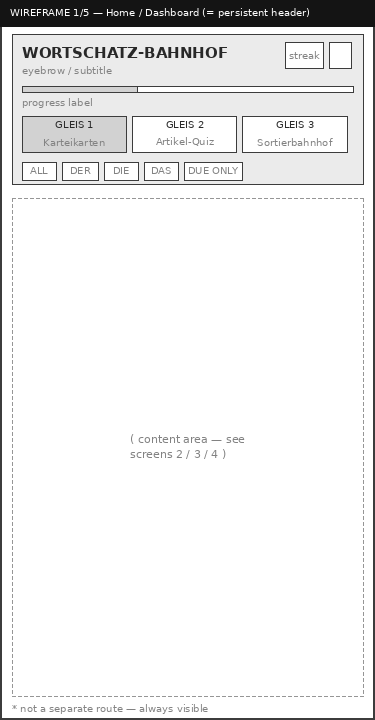
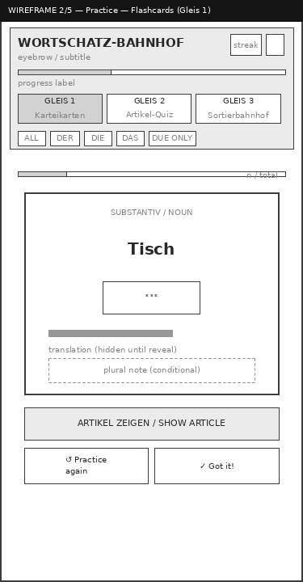
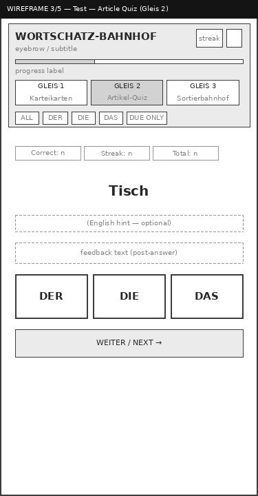
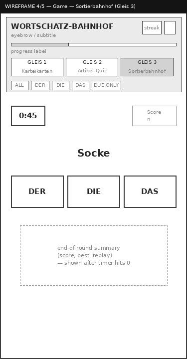
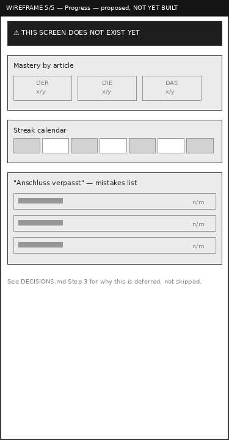

# Wortschatz-Bahnhof — Wireframes (Retrospective)

These wireframes were produced **after** the working prototype, not before —
documented here as a deliberate retrospective step, per the roadmap: build the
low-fidelity structural version of what already exists, then compare it
against the real implementation to catch structural issues that are easy to
miss once real content and styling are in place.

**Generation:** Wireframe images are generated from `build_wireframes.py`
— a Python script using PIL — so they're reproducible and can be updated
if the UI changes. This approach ensures consistent styling across all
wireframes and makes updates trivial.

Grayscale, box-and-label only, no color/typography decisions — that's
intentional; visual identity is a separate, already-settled concern (see
`04-style/visual-design.md` and `DECISIONS.md`, Step 1).

---

## 1. Home / Dashboard



**Wireframe intent:** A dedicated dashboard screen showing progress overview,
streak, mastered count, and navigation to the three practice modes.

**Implementation reality:** There is no separate Home/Dashboard *route*. What
the roadmap called "Home/Dashboard" is the persistent header block — title,
streak, mastered count, progress bar, the three Gleis tabs, and the filter
chips — which stays visible above whichever mode (Gleis 1/2/3) is active.

**Comparison verdict: intentional deviation, not a gap.** A single-page app
with three lightweight modes doesn't need a separate dashboard route the user
has to navigate away from to start practicing — that would add a click
between opening the app and actually studying, which cuts against the "daily
5-minute habit" goal. Keeping stats always-visible in the header does the
dashboard's job without the extra step. Documenting this here so it reads as
a decision, not an oversight, in the case study.

---

## 2. Practice — Flashcards (Gleis 1)



**Wireframe intent:** A flashcard-style learning mode where the learner sees
a noun, reveals the article and translation, then self-rates their recall.

**Implementation reality:** Matches closely. Card → reveal button → article
flap animation → translation → conditional plural-disambiguation note (Step
2b) → Again/Got it actions. The session progress bar tracks cards viewed
within the current filtered pool.

**Comparison verdict: matches, one addition beyond the original wireframe
intent.** The plural-note block wasn't part of the initial concept — it was
added in Step 2b after the dataset review surfaced the der/das-vs-plural-die
confusion risk. Included here because the wireframe is retrospective; it
should reflect what's actually there, not just the original plan.

---

## 3. Test — Article Quiz (Gleis 2)



**Wireframe intent:** An active recall quiz where the learner must select the
correct article (DER/DIE/DAS) before seeing the answer, with immediate
feedback and controlled pacing via a "Next" button.

**Implementation reality:** Matches. Running stats row (Correct, Streak,
Total), noun displayed prominently, three article buttons, feedback line with
translation, next button. Quiz buttons show correct/wrong states with color
coding.

**Comparison verdict: one planned element not yet implemented.** The English
hint line is wireframed as optional/dashed because the current build doesn't
show it at all — `quizEn` exists in the DOM but is never populated. Worth a
decision later: either wire it up as a toggleable hint, or remove the dead
element. Not fixing now — out of scope for Step 3, logged for Step 9 (mode
improvements).

**Additional note:** The current implementation also displays plural
disambiguation notes in the feedback when relevant (e.g., for words like
"Kind" where the plural "die Kinder" could cause confusion). This is another
retrospective addition not shown in the original wireframe.

---

## 4. Game — Sortierbahnhof (Gleis 3)



**Wireframe intent:** A timed, rapid-fire sorting game where words appear and
the learner must quickly assign them to the correct platform (DER/DIE/DAS)
under time pressure.

**Implementation reality:** Matches for the active-round state (timer, score,
word, three buttons). The wireframe also shows the end-of-round summary
panel as a separate conceptual block — in the implementation this is a
genuinely separate DOM view (`#sortResult`), swapped in when the timer hits
zero, not an overlay. Matches wireframe intent.

**Comparison verdict: matches.** No action needed. The pre-game state (start
screen showing best score) and post-game summary (score, best score, play
again button) are both present as wireframed.

---

## 5. Progress — proposed, not yet built



**Wireframe intent:** A dedicated progress screen showing mastery breakdown
by article, a streak calendar, and a "mistakes" list (Anschluss verpasst) of
words the learner frequently gets wrong.

**Implementation reality: this screen doesn't exist.** "Progress" today is
just the streak number and mastered count living in the header (shared with
every other screen) — there's no dedicated view for mastery breakdown by
article, a streak calendar, or a mistake list.

**Comparison verdict: real gap, deliberately deferred, not forgotten.**
This wireframe sketches what the roadmap's Step 10 ("Mistakes" / *Anschluss
verpasst*) and Step 8 (progression) would need structurally: mastery counts
split by der/die/das (useful since the three articles aren't learned at an
even rate), a streak calendar for a sense of consistency over time, and a
list of specifically-struggled-with words pulled from the existing
`seen`/`correct` counters already being tracked per word. Nothing here
requires new data collection — the underlying numbers already exist in
`progress.perNoun`; this is a presentation gap, not a data gap. Building it
is scoped to Step 10, not Step 3.

---

## Summary Table

| Screen | Status | Action |
|---|---|---|
| Home/Dashboard | Merged into persistent header — intentional | None |
| Practice (Flashcards) | Matches, plus Step 2b addition (plural notes) | None |
| Test (Quiz) | Matches, minor dead element (`quizEn`) | Defer to Step 9 |
| Game (Sort) | Matches | None |
| Progress | Does not exist yet | Build in Step 10 |

---

## Key Findings from Retrospective Comparison

1. **Dashboard as header** — The decision to merge dashboard into the
   persistent header removes friction but means stats are always visible,
   which is actually a UX improvement for a daily habit tool.

2. **Plural disambiguation** — Added after dataset review, this is now
   surfaced in both flashcards and quiz modes to prevent learners from
   incorrectly inferring gender from plural forms.

3. **Dead UI element** — `#quizEn` exists but is never populated. This
   represents either a half-implemented feature (English hints) or leftover
   markup that should be removed. Logged for resolution.

4. **Progress screen gap** — The data exists but the view doesn't. This is
   the largest gap between wireframes and implementation, but it's a
   presentation gap rather than a data gap, making it a clean addition later.

5. **Wireframe generation** — Using a Python script with PIL ensures
   wireframes are reproducible and consistent, and the text-based approach
   makes them accessible and version-controllable.

---

## How to Regenerate Wireframes

```bash
# Install dependency
pip install Pillow

# Navigate to wireframes directory
cd docs/02-wireframes

# Run the generator
python build_wireframes.py

# Output: 1-home-dashboard.png, 2-practice-flashcards.png, etc.