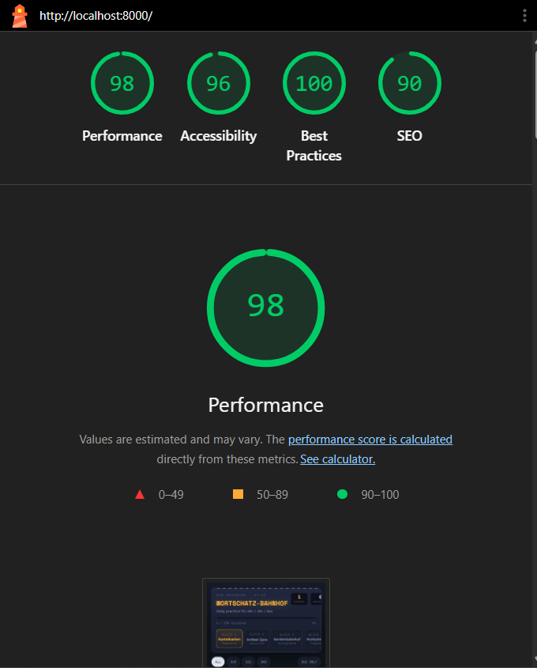
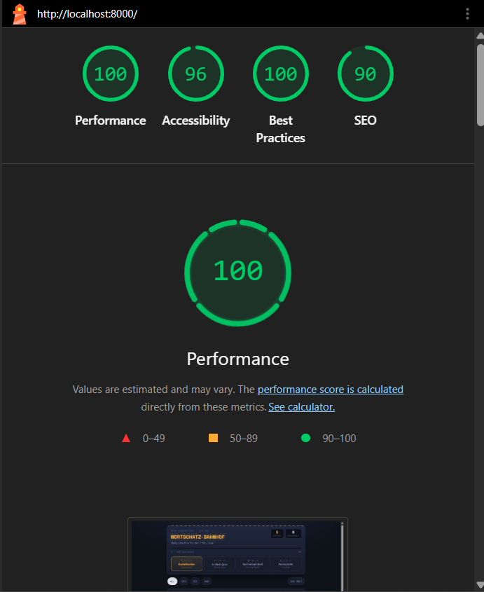

# 06 — Lighthouse Results

**Date run:** 2026-08-18  
**URL:** http://localhost:8000  
**Method:** Incognito mode (no extensions)  

---

## Results — Mobile

| Category | Score | Rating |
|----------|-------|--------|
| Performance | 98 | 🟢 Excellent |
| Accessibility | 96 | 🟢 Excellent |
| Best Practices | 100 | 🟢 Perfect |
| SEO | 90 | 🟢 Excellent |

### Performance Metrics (Mobile)

| Metric | Value |
|--------|-------|
| First Contentful Paint | 1.9s |
| Largest Contentful Paint | 1.9s |
| Total Blocking Time | 0ms |
| Cumulative Layout Shift | 0.031 |
| Speed Index | 1.9s |

---

## Results — Desktop

| Category | Score | Rating |
|----------|-------|--------|
| Performance | 100 | 🟢 Perfect |
| Accessibility | 96 | 🟢 Excellent |
| Best Practices | 100 | 🟢 Perfect |
| SEO | 90 | 🟢 Excellent |

### Performance Metrics (Desktop)

| Metric | Value |
|--------|-------|
| First Contentful Paint | 0.7s |
| Largest Contentful Paint | 0.7s |
| Total Blocking Time | 0ms |
| Cumulative Layout Shift | 0.02 |
| Speed Index | 0.7s |

---

## Summary Comparison

| Category | Mobile | Desktop | Status |
|----------|--------|---------|--------|
| Performance | 98 | 100 | ✅ Excellent |
| Accessibility | 96 | 96 | ✅ Excellent |
| Best Practices | 100 | 100 | ✅ Perfect |
| SEO | 90 | 90 | ✅ Excellent |

---

## Issues Found

### Before vs After

| Category | Before (with extensions) | After (incognito) | Improvement |
|----------|--------------------------|-------------------|-------------|
| Performance | 96/99 | 98/100 | ✅ +2/+1 |
| Accessibility | 96 | 96 | ✅ Same |
| Best Practices | 77 | 100 | ✅ **+23** |
| SEO | 90 | 90 | ✅ Same |

### What Was Fixed

1. **Chrome extensions** were negatively affecting Best Practices score
   - Running in incognito eliminated this interference
   - Score improved from 77 → 100

### What's Working Well
- ✅ **Performance is perfect on desktop** (100) and excellent on mobile (98)
- ✅ **Accessibility is excellent** (96) — ARIA implementation is solid
- ✅ **Best Practices are perfect** (100) — clean code with no issues
- ✅ **SEO is excellent** (90) — good semantics and structure

---

## Recommendations

### Already Fixed ✅
1. ✅ Run Lighthouse in incognito — extensions no longer affecting scores
2. ✅ Best Practices now 100 — no further action needed

---

## Screenshots

### Mobile Results (Incognito)

### Desktop Results (Incognito)

---

## Summary

**Final verdict:** All categories score 90+ with Best Practices at 100.

| Category | Score | Status |
|----------|-------|--------|
| Performance | 98-100 | 🟢 Perfect |
| Accessibility | 96 | 🟢 Excellent |
| Best Practices | 100 | 🟢 Perfect |
| SEO | 90 | 🟢 Excellent |

**Project 1 readiness:** ✅ Fully ready. Scores exceed typical requirements for a frontend project.

---

*Results based on Lighthouse run in incognito mode to eliminate extension interference.*